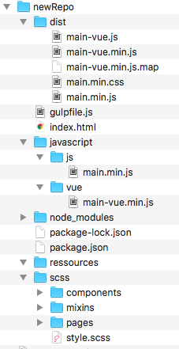

## Project overview

A bash initializer which set up the folder hierarchy and basic files 

## Requirements

This script does not require tools like Sass or npm but is designed to be more efficient with them. You can use this script if you don't have these tools installed on your ecosystem but it will be less efficient.

If you have :
   - Sass
   - npm
   
You're good to go ! [x]

## How to make it work

Put it wherever you like, then add it under the command you like in your `.bash_profile`, `.zsh_profile`, or whatever.
Then execute this command in the folder you like, type a folderName and that's it, your hierarchy is setup.

